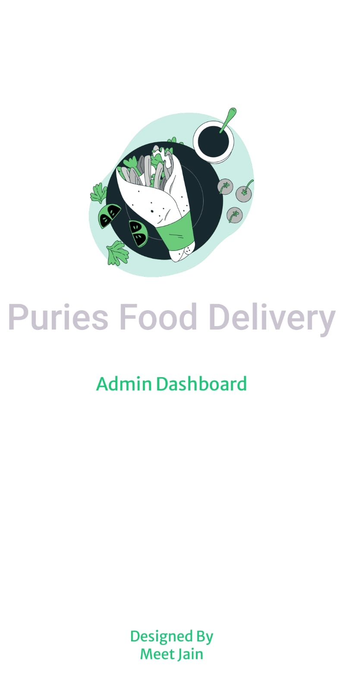
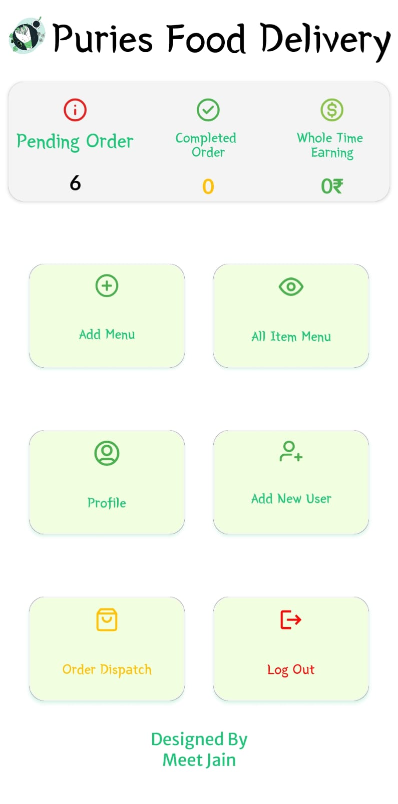

<div align="center">

# 🛡️ Puries Food Delivery - Admin App

_The central management hub for restaurant owners and staff to handle orders, update menus, and track earnings._


</div>

---

## 📖 About The Project

This is the **Admin & Restaurant Management** companion app for the Puries Food Delivery ecosystem. Built natively with Kotlin, this application gives restaurant owners complete control over their digital storefront. It provides a real-time overview of business metrics, allows for instant menu updates, and facilitates smooth order dispatching to ensure customers get their food hot and on time.

## ✨ Key Features

- 📊 **Live Dashboard:** Get an instant overview of pending orders, completed orders, and total lifetime earnings.
- 🍔 **Menu Management:** Easily add new food items with images, prices, short descriptions, and ingredients.
- 📋 **Inventory Control:** View the complete catalog in the "All Items" tab to adjust availability or delete discontinued dishes.
- 🚚 **Order Dispatching:** Manage the flow of food from the kitchen to the customer, tracking items that are "Out For Delivery".
- 👥 **Staff Access Control:** Securely create new Admin user accounts to delegate restaurant management tasks.
- 👤 **Admin Profiles:** Dedicated profile management to update restaurant contact details and secure passwords.
- 🔔 **System Alerts:** Visual snackbar/toast confirmations (e.g., "Data Uploaded Successfully") to ensure actions are completed.

---

## 📱 Admin App Gallery

<table align="center" style="width:100%; border-collapse: collapse;">
  <tr>
    <td align="center" width="50%">
      
      <br><br>
      <b>Admin Welcome</b><br>
      <sup>Clean splash screen distinguishing the secure Admin portal from the user app.</sup>
    </td>
    <td align="center" width="50%">
      
      <br><br>
      <b>Management Dashboard</b><br>
      <sup>At-a-glance analytics for orders/earnings and quick-access grid menu.</sup>
    </td>
  </tr>
  <tr>
    <td align="center">
      
      <br><br>
      <b>Add Menu Items</b><br>
      <sup>Upload food images, set pricing, and list ingredients straight from the app.</sup>
    </td>
    <td align="center">
      
      <br><br>
      <b>Inventory Catalog</b><br>
      <sup>Review the entire menu, adjust item quantities, or remove outdated dishes.</sup>
    </td>
  </tr>
  <tr>
    <td align="center">
      
      <br><br>
      <b>Create New Admin</b><br>
      <sup>Onboard new staff members or managers with secure credentials.</sup>
    </td>
    <td align="center">
      
      <br><br>
      <b>Profile Management</b><br>
      <sup>Update personal/business contact information and address details.</sup>
    </td>
  </tr>
  <tr>
    <td align="center">
      
      <br><br>
      <b>Delivery Tracking</b><br>
      <sup>Monitor orders that have left the kitchen and are en route to customers.</sup>
    </td>
    <td align="center">
      
      <br><br>
      <b>Action Confirmations</b><br>
      <sup>Clear UI feedback ensuring managers know their updates were saved to the database.</sup>
    </td>
  </tr>
</table>

---

## 🛠️ Tech Stack

- **Language:** Kotlin
- **Platform:** Android SDK
- **UI / Layout:** XML / ConstraintLayout
- **IDE:** Android Studio

## 🚀 Getting Started

To explore the admin source code:

1. Clone this repository:
   ```bash
   git clone [https://github.com/meetjain6091/Admin-Puries-Food-Delivery-App.git](https://github.com/meetjain6091/Admin-Puries-Food-Delivery-App.git)
   ```
